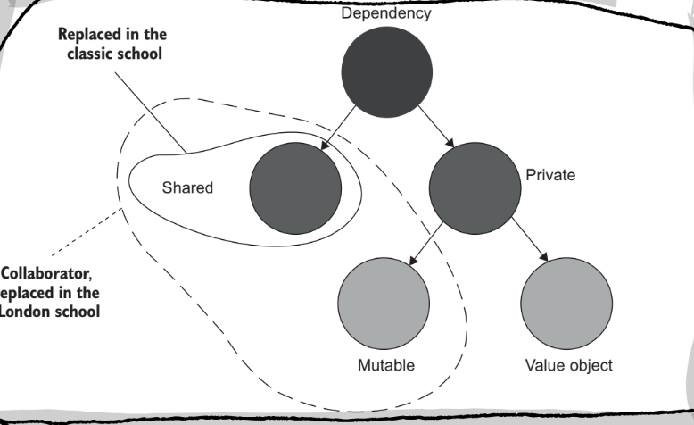

Learning unit testing isn’t just about learning the frameworks and technical details. There is more to writing unit tests than the act of writing tests. **You need to strive for the best return on investment of your time and minimize your efforts while maximizing the gains from your unit tests.** 

The projects that have great unit tests grow effortlessly, they don’t require much maintenance, and features can be added or changed quickly and reliably. Conversely, projects with no unit tests or bad unit tests are hard to maintain, costly, and constantly riddled with bugs. 

**The ability to write a unit test for a piece of software is a good negative indicator of code quality**. If you cannot write a test easily, it is a great indicator that the code is poorly written; **the opposite is not necessarily true if you can write a test that doesn’t say much about your code.** 

What are the goals of unit tests? To create a foundation for sustainable growth of a software project. It’s easy to grow a software project at the start, but it becomes much more difficult over time.

We can reduce *software entropy* with unit tests. This is a much better phrase than technical debt.

Unit tests are costly; many activities involve writing and maintaining unit tests. These have time and cognitive costs associated with them. Here are some of the tasks

- Refactoring the tests when you refactor underlying code
- Running the test on each code change
- Dealing with false alarms raised by the test
- Spending time reading the test when you’re trying to understand how the underlying code should behave.

**Code is a liability, not an asset. The more code you have, the more surface area there is for bugs and vulnerabilities. This results in high upkeep costs. Tests are code, too. You should treat them with the same care as you treat production code.** Tests can have bugs and maintenance costs with them as well. 

Coverage metrics provide valuable feedback for measuring the quality of a test suite, but they are a negative indicator, not a goal. They can say when a test suite is not good, but they cannot say when a test suite is good.

There are two problems with using test coverage as a goal:

- You can’t guarantee that the test verifies all possible outcomes of the system under test
    - Shorter code scores better on this metric without actually being better
    - They are hackable
- No coverage metric can take into account code paths in external libraries.

When test coverage goals are introduced, people seek ways to attain high coverage instead of testing what matters.

What makes a good test suite?

- It’s integrated into the development cycle.
- It targets the most important parts of your code base.
- It provides maximum value with minimum maintenance costs.

It’s important to test the most critical part of your system with unit tests. Not all code is created equal in the eyes of a test. The domain model is an excellent candidate for the highest value for unit testing. 

Unit testing the domain model forces us to isolate it from the application layer of our code, which is also a benefit. 

**Unit tests and the code it tests are highly intertwined. The same person who writes the code should be writing the test. It’s impossible to create a good unit test without putting significant effort into understanding the code it tests.**

---

## What is a unit test?

There are two philosophies on unit testing. The classical style (also called the Detroit style) and the London style (occasionally called the mockist style). These philosophies have subtle differences in what a unit test is that lead to massive ramifications on how unit tests are used in practice. 

Broadly speaking, the two groups agree on the basics of a unit test. It is an automated test that:

- Verifies a small piece of code (a unit)
- Do it quickly
- And does it in an isolated manner.

The ambiguity lies in the third point.

The London School of Unit Testing describes isolation as separating the system under test from its collaborators. It means if a class depends on another class, they must be replaced with test doubles.

A test double is an object that looks and behaves like its release counterpart but is significantly simplified to reduce the complexities and facilitate tests.

During the arrange phase of a unit test, the test will assemble the structure under test (SUT) and its collaborators.

**The classical approach says isolation should be done to the code being tested, not to the tests themselves. Each test should run in an isolated environment that other tests cannot affect.**

Classical tests can always be run in parallel or sequence or any other order without affecting the results. Isolating tests from each other means testing multiple classes within the same test is fine.

A *shared dependency* is a dependency that is shared between tests. Like a shared database, in the classical approach, this is not allowed. A *private dependency* is a dependency that is not shared (a database contained within a docker image).

An *out-of-process* dependency runs outside the application’s execution process. It’s a proxy to data that is not yet within memory.  An out-of-process dependency can be shared or private, but most likely is shared.

In the classical style, you still use test doubles to mock shared dependencies. This means shared dependencies between the tests, not the classes. 

A *vol*a*tile* dependency can either require configuration of the runtime system (like a database needing to be installed on the system before tests can be run) or contain no deterministic behaviour (within reason, a filesystem is not volatile in most cases). 

Substituting shared dependencies with test doubles also has the benefit of improving test speed. Normally, calls to shared dependencies will incur a cost that will add up over many tests.

|  | Isolation  | Unit | Test doubles for |
| --- | --- | --- | --- |
| London school | Units of code | A class | All but immutable dependencies |
| Classical school | Unit tests | A set of classes | Shared dependencies |

A *collaborator* is a dependency that is either shared or mutable.

Not all out-of-process dependencies are shared dependencies (especially Docker containers)

The goal of unit testing is the sustainable growth of your project. 

**Tests should test units of behaviour rather than units of code***. ***Something meaningful in the context of the project that a non-technical person could understand.** Otherwise, you end up testing implementations, not behaviours.   

**A test should tell a story about the problem the code helps to solve, and this story should have meaning outside of the program and be understandable to the business at large.**

**In the classical style, you must create a full object graph for each test. If this is tedious, it’s a good indicator that you have dependency issues.** Instead of finding ways to test large call graphs, you should focus on not having such graphs in the first place. The large call graph is a symptom of a design problem.

The London style leads to outside-in or top-down thinking. You start with the high-level class and mock all of its collaborators. This doesn’t require that the collaborators exist yet. Then, you work through the call graph until you have built all the collaborators. 

**With the classical style, you start with the domain model and add additional layers. This means the domain layer will be tested as part of application layer unit tests.**

These differences in the development process lead to the London style being susceptible to testing implementation details instead of behaviours. This is the main objection against the London style.

A test is an integration test when it verifies two or more behaviours or runs slowly. 

The difference between an integration test and an e2e test is ambiguous. Still, an integration test generally works with only one or two dependencies, and an e2e test looks to work with all dependencies.

---

## Anatomy of a unit test

To reduce cognitive overhead and improve readability, use the AAA pattern. Create a separate block for *arranging* your dependencies and sut. A*cting* on your sut by calling the function you wish to test and *asserting* the resulting state is correct.

**It is valid to begin writing a test with either the arrange or assert phase of the test. By starting with the assert stage, you are able to define what the function should do. This supports TDD.** 

Avoid multiple arrange, act or assert sections. This is an indicator that you are testing more than one behaviour.

Avoid if statements and other branching logic in your test. These indicate you are testing more than one behaviour.

**The act statement should be a single line of code.** 

You may have multiple assertions. A single behaviour may exhibit multiple outcomes. If you have too many assertions, that may be an indicator you need to have better equality checks.

**It’s important to separate the SUT from its dependencies to keep cognitive overhead low. To do this, always name the SUT in tests `sut`.**

Differentiate the three sections of your unit tests with either an empty line or comments.

Create private factory functions for fixtures. This way, you can still see what state the fixture is creating. This supports high readability and reusability in your tests. 

**Name your unit test with phrases describing what they do. Use proper English grammar. Don’t follow a rigid naming policy. Use a high-level description of the behaviour that a non-technical person could understand.** 

**Don’t use `should` in tests. A test is a fact about the way the code should behave.** There’s no room for wishing or desire. 

You can group multiple tests into one by parameterizing the test, but you should still only ever test one behaviour. You need to separate the positive and negative test cases at any rate. 

Use an assertion library. You can use a fluent assertion library for more readable tests

---

# The four pillars of a good unit test

A good unit test has the following four attributes

- Protection against regression
- Resistant to refactor
- Fast feedback
- Maintainability

You can analyze any automated test using these four principles

A regression is a software bug. When a feature stops working the way it should due to some code modification

Code is not an asset it is a liability. The larger your code base the more exposure there is for bugs. That’s why protecting against regression is so crucial.

A test that is resistant to refactor will not create a false positive when a correct refactor is made. If a refactor is made that does not change the behaviour of the code than the test should not fail.

**A test suite is only valuable if it:**

- **Provides early warnings when you break functionality**
- **Builds confidence that your code changes won’t lead to regressions**

**False positives interfere with both of these requirements:**

- **If a test fails for no good reason, it dilute your ability and willingness to react to problems**
- **When false positives are frequent, you lose trust in the test suite.**

The number of false positives in your tests is directly related to how your code is structured. **The more a test is coupled to the implementation rather than the behaviour the more likely a false positive will occur. The only way to reduce your chance at getting a false positive is to decouple your test from the implementation. The test should treat the sut the same way the end user will; checking that the outcomes are meaningful and correct.**

The best way to structure a test is to make it tell a story about the problem domain.

Addressing false positives is the best way to improve the performance of a test suite. False negatives are hard and just require writing more tests, but if you write more tests that are tied to implementation those tests create false positives and become useless. So the most important aspect to address is a false positive.

The process of refactoring is changing the implementation of a piece of code while keeping the observable behaviour the same. This should not result in a test breaking.

It is important to have protection to regression at all stages in a project life cycle, but resistance to refactor is only important as the project grows (and needs to be refactored). Hence resistance to refactor is really the scaling/maintainability drive in a software project.

The accuracy of a test is a measurement of the quality of the first two pillars of a good test: protection from regression and resistance to refactor. To measure accuracy:

- How good the test is at indicating the presence of bugs (lack of false negatives)
- How good the test is at indicating the absence of bugs (lack of false positives)

False positives are not as bad as false negatives, but we have much better control over how many false positives we have.

Most people overprioritise making tests protect against regression, but this isn’t enough to create a high accuracy test suite. The reason is far fewer projects grow larger, and require a high level of resistance to refactor to sustain growth. Therefore developers face more false negatives that false positives in the early stages of a project.

Slow tests prolong the feedback loop of a test. If the cost involved in running a test is to high this will delay the amount it is run which prolongs the time before a bug is noticed, and increase the cost of fixing it. Slow test discourage you from running them. 

The fourth pillar of maintainability of a test is based on:

- how hard it is to understand the test
- how hard it is to run the test

These four pillars can be multiplied together to get an overall score for a test suite:

A small number of highly valuable tests is much better than a large number of mediocre tests. 

It is impossible to score a perfect score in the value of a test because some of the pillars are mutually exclusive: protection against regression, resistance to refactor, fast feedback.

end to end tests provide protection against regression and resistance to refactor, but they are slow. They are particularly good at being resistant to refactoring because the only test observable behaviour.

A trivial test provides fast feedback, and are resistant to refactor, but they do little to protect against regression because they are trivial. The extreme example is a tautology test. The cannot test a large section of the code while remaining trivial.

A brittle test can run fast and protect against regression by testing the exact implementation of a function (imagine taking a hash of a function's content). This is perfect protection against regression, but any refactor will instantly create a false positive.

So we can’t have a maxed out score in the value of our test, but it’s also important not to have a score to low in any one of our fields otherwise we get useless tests. This makes writing a good test suite a balancing act.

It turns out resistance to refactor is the non negotiable in our test suite. This is because it is the most controllable and the most binary of the three types of test. A suite either is resistant to refactor or it isn’t. While a system can have various degrees of protection against regression and fast feedback. Essentially the real decision becomes a slider between protection against regression and fast feedback. 

Based on the decision between fast feedback and protection against regression we build the test pyramid which allows us to build a few tests along the spectrum between protection against regression and fast feedback.

Tests at the bottom value fast feedback where tests at the top value protection against regression, but they all have a focus on being resistant to refactor.

The test pyramid doesn’t necessarily have to be a pyramid for different types of applications there may be a higher emphasis on different areas of the testing . For instance CRUD application value integration tests over unit tests because there is no logic in the application.This results in creating more of a test rectangle.  

Test can either be white box or black box. A black box test does not make any analysis into the implementation of the test. While a white box test is free to test internal communication and intermediate steps of the sut. This make white box testing susceptible to false positives.

**Black box testing is a more effective use of your time, however you may use the whitebox perspective to analysis your tests**. You can use code coverage tools (white box techniques) to see where your tests are missing details. 

---

# Mocks and test fragility

There’s a connection between mocks and test fragility. 

A test double is an overarching term that describes all non-production fake dependencies in a test.

The difference between mocks and stubs is: mocks help to emulate and examine the outcoming interactions (was this dependency called with the correct args). Stubs help to emulate incoming interactions (what happens if the dependency returns this value).

Never assert interactions with stubs. A call from the sut to a stub is not part of the observable behaviour of the stub. Not part of the outcome.

**The practice of verifying this that aren’t part of the end result is called over-specification.**

Sometimes you need to create a test double that exhibits the behaviour of both a stub and a mock. These doubles both return a canned result and verify the method called by the sut.

When a test double is both a mock and a stub it is called a mock.

Mocks and stubs are closely related to CQRS. The principle of CQRS says every function should either be a command or a query, but never both. Following this principle leads to tests that either use a mock or a stub but not both. Commands are methods that produce a side effect and do not return a value, queries return values, but to not produce side effects. Also safe vs unsafe.

**When creating a test double that substitutes a command you use a mock, when a test double substitutes a query it becomes a stub.**

Tests should focus on what is happening not how it is happening, mocks and stubs can make this difference hard. They are related to the implementation not the behaviour. 

### Observable behaviour is not the same a a public API

All code can be categorized along two dimensions 

- Public API vs Private API
- Observable behaviour vs implementation detail

These categories do not overlap. A function cannot be both public and private, and it cannot be both an observable behaviour and an implementation detail.

**To be part of the systems observable behaviour a function must either:**

- **Expose an operation that helps the client achieve one of its goals.**
- **Expose state that helps a client achieve one of its goals.**

Any code that does neither of these two tasks is an implementation detail.

Whether or not a function fulfills these goals also depends on who the client is, there end up being layers of clients that build up a system. 

**An API is said to be well designed if the public API and the observable behaviour is the same thing, and the private api and implementation details are the same.**

If the systems public API extends to behaviour or queries that are not part of the observable behaviour and start exposing implementation details this is known as a leak.

**If the number of operations a client has to preform to invoke a single goal is more than one this is often an indication of a leak. Any goal should be achievable with a single operation.**

Maintaining a well-designed API involves creating good encapsulations. An encapsulation is the act of protecting a set of invariant, or conditions that must hold true. 

**Encapsulation is critical for a code base to be maintained in the long run because an encapsulation is hiding a bit of complexity withing an module. If the complexity is leaked then each module must encode the complexity of other modules as well as the module itself.**

Without encapsulation there is no way to cope with the added complexities of added new features. Encapsulation should guide you through how to preform actions. **When you see an API you should not have to lookup other calls to find the right information to use. The API should guide you through what is allowed to be done.**

**An API should relieve you of the mental burden of using the service it protects by encapsulating the details of that service and hiding them from the client. You cannot trust your clients to do the right thing, so eliminate the possibility of them doing the wrong thing.**

Hiding implementation details helps you remove class’s internals from your clients, and bundle data and operations to maintain invariant.

**There is an intrinsic connection between good unit testing and a well designed API.** By making internal details hidden you are able to create both a testable module and a well designed API.

A resulting guideline from the discussion of well-designed APIs is: you should expose the absolute minimum number of operations and state required for the observable behaviour of your system. Everything that is an implementation detail should be hidden as private code.

**A typical application consists of two layers: a domain layer and an application layer. The domain layer is the central part of your system and it consists of the business logic. The domain layer and business logic are what differentiate your system from your competitors, they are your competitive advantage.** 

The application layer sits on top of your domain layer and orchestrates communication between that layer and the outside world. This layer coordinates out-of-process dependencies and the domain layer. It is responsible for:

- Queries to the database and creating a domain class from external storage
- Invoking operations on the domain instance generated in the step above
- Save the result of the operation back to out-of-process storage

This is sometimes referred to as the hexagonal architecture. It has three important components:

- The separation of concerns between the domain and application services
- Coordinate communication inside your application (so classes inside the domain model only depend on their own bounded context)
- Communication between applications should be done at application level **(a single application should protect a domain, and only that application should access the domain).**

For a function to be part of the observable behaviour it needs to help a client achieve one goal. For the domain layer the client is the application layer, and for the application layer the client is the external client. 

There are two types of communication between your applications: intra-system communication is communication between classes inside your application, inter-system communication is between different applications.

Using mocks to verify communications between classes inside your system couples your tests to your implementation and jeopardizes your resistance to refactor. 

The London school of testing encourages mocks for all but immutable dependencies and doesn’t differentiate between inter and intra system communications. As a result tests check communications that happen within the system, this leads to brittle tests.

In the classical style of testing not all dependencies should be mocked. If an out of process dependency is only accessible through your application then communication with the dependency are not part of the observable behavior of the system. 

**A database that is only used by a single application should not be mocked, because it is not part of the observable behaviour of your system. If you share a database across multiple applications, every call to the shared component of the database should be mocked.**

## Styles of Unit Testing

There are three styles of unit testing: output-based, state-based, and communication based testing. The output based test is best with the state based testing being second best.

Output-based testing is where you feed input into your sut and check the observable output of the system.This is testing the behaviour of the system because the API that you’re testing should only expose business features.

In state based testing you run an action on the sut and then check that the state of some component matches your expectations. This can be the state of the sut, a collaborator or an out-of-process dependency such as a database.

Communication based testing uses mocks to verify the communications between the sut and the collaborators. 

**Output based testing provides the best protection from regression because resulting tests couple only to the sut, and not any implementation details.**

State based testing is usually more prone to false positives because in addition to acting on the sut you are also checking state potentially of a collaborator which could be an implementation detail.

communication style testing is almost always testing implementation details, because the communication required to achieve a behaviour is just an implementation detail

maintainability is an important factor of unit tests, that allows the unit test to support the growth of the project. it depends on 

- how hard it is to understand the test (which also depends on the test size)
- how hard it is to run the test

output based testing is the most maintainable testing style. The resulting tests are always short and to the point.

state based test are a little bit less maintainable because the assert statement will be more verbose and less related to the actual test.

communication based tests are the least easy to maintain because they require a lot of setup and the actual communications that are monitored may not be directly related to the purpose of the test

overall output tests are the best tests, they produce tests that are rarely coupled to the implementation details and are easy to maintain.

it is easier to analyses if a test is a good test then to create good tests. functional architecture is a good way to facilitate good tests.

there are many similarities between functional architecture and hexagonal architecture. the main point of difference is that the hexagonal architecture is allowed to make unsafe or mutable function calls in the domain, whereas functional architecture does not allow this. 

another similarity between the two architectures is the one way flow of data. the application layer can depend on the domain layer, but the domain layer may not depend on any other layers.

functional architecture is a subset of the hexagonal architecture where the domain layer is made up of pure methods. this leads to the best testing.

hexagonal architecture can be more efficient where the domain can rely on some calculation made in a database. in order to create an new user account with a unique email address, in functional architecture the application with have to make intermediate calls to the domain layer at multiple steps, in hexagonal architecture the domain layer can use the database as part of it’s functionality.

To refactor an architecture towards a functional architecture there are two steps

1. move from using an out of process dependency to using a mock
2. move from using a mock to using functional architecture

for a system that is highly coupled on the file system, first create a mock for the file system and use it in the test  as is, then create a domain layer that is pure that takes the result of the call from the application layer.

instead of hiding side effects behind interfaces and injecting interfaces into your domain/application, it is better to move the side effects to a different class entirely and use the application to coordinate between your side effect class (mongo class) and your domain class.

the end state is to have the domain layer accept the result of mutable calls and return results that will be saved in the persistence layer coordinated through the application layer. returns an instruction to save or update.

this is how we separate between business logic and transport / peristence logic.

a function from the domain layer should not work with a collaborator, but instead work with the product of its work, a value.

the performance impact to the system as a whole is a common argument against the functional architecture.

the choice between functional and hexagonal is a tradeoff between maintainability and performance, there is no one size fits all solution.

not all code bases are worth refactoring towards the functional architecture, it is a high cost, high reward en devour, so only do it for parts of your systems that require high quality code.

## Refactoring towards valuable unit tests

its rarely possible to significantly improve a test suite without refactoring the underlying code. tests and production code are intrinsically connected… by design.

all production code can be categorized along two axis

- complexity and domain significance
- the number of collaborators

Code complexity is defined by the number of decisions making branching points (cyclomatic complexity)

cycolomatic complexity is 1 + {{number of branching points}}, it is the number of independent paths code can go down to get to the result. also the number of tests needed to achieve 100% branch coverage.

domain significance is how important a piece of code is for the problem domain of your project. domain significance isn’t necessarily related to complexity, but for the purpose of refactoring they form a good group to think about. 

impllicit and explicit collaborators make up the second axis.

based on these axises we can categorize code in the following way:

- (domain code) domain model and algorithm code  + high complexity code without collaboratgors
- code that is neither complext, domain important or has collaborators (trivial code)
- code that has a lot of collaborators but is not domain code (controller code)
- code that has lots of collaborators and high domain significance or complexity (overly complicated code)

domain code gives the best opportunity for for beneficial unit tests, these algorithms can be tested while retaining all parameters for good unit tests. (fast, resistent to refactor, protect from regression, maintainable)

trivial code should not be tested at all, such tests have close to zero value and incur a maitainance cost,

controller code should be tested briefly with integration tests

the most problematic section of code is the over complicated section. this type of code normally needs to be refactored before it can be properly tested.

if you want to improve your code base the two easiest wins are unit testing your domain code and refactoring your overly complicated code.

with this approach you won’t ever reach 100% coverage but you don’t need to, you need to focus your efforts on high value tests and improving the scalability and reliability of your project.

we often find code is hard to test because it is overly coupled to a framework dependency, examples include inside asynchrnonous code, multi threaded executions, user interfaces, and comms with out of process dependencies.

to deal with this overly complicated code you need to bring the testable components out. one approach is to use the humble object:

this is a pattern that exists in both the functional architecture and the hexagonal architecture. The controller acts as the humble object.

functional architecture goes a step further and separates all business logic from communication with any collaborator not just out of process ones. this is what makes functional architectures more testable there are not collaborations.

another way to think about the humble architecture is through the lens of single responsibility principle. the humble object separates the collaboration responsibilities from the logic responsibilities.

you can think of these responsibilities as code depth for domain code and code width for collaboration code. code and be rectangular, but never square.

this is also similar to the aggregate pattern from DDD, the aggregate reduces connectivity between classes by grouping them into clusters (aggregates). the classes are highly connected within a aggregate and loosely coupled across aggregates. 

Some other tips to refactor towards testable code is:

- make implicit dependencies explicit
- introduce an application service layer
- remove complexity from application service
- introduce a collaborator class (db class)

the separation between business logic and orchestration works best when a business operation has three distinct stages:

- retrieving data
- executing business logic
- persisting changes.

there are many situations where this doesn’t apply :( but when it does apply use the application layer. it doesn’t apply when you need to query extra data based on the result of a domain function.

in the case when you need to make additional collaborator calls based on the result of a domain functions you have three options

- push all external reads and writes to the edge any ways. this is the functional architecture that sacrifices performance
- inject the out of process dependency into the domain layer
- split decision making process into more granular steps (hexagonal architecture)

The challenge in these situations is to balance the following attributes

- domain model testibility
- controller simplicity
- performance

each option gives you two out of the three attributes

pushing all external reads to the edge perserves controller simplicity and domain testibility but sacrifices performance. this is preloading all data that could potentially be relevant before any calculations are made. 

injecting out of process dependency into the domain keeps performance and controller simpcity but makes the domain harder to tests.

splitting decision making process into granular steps helps performance and domain testibility but hurts controller simplicity, as the controller now is promoted to an orchestrator.

for most cases splitting decision making process into granular steps is probably the most practical option. because performance is a non negotiable and injecting out of bound processes into domain undermines the whole point of this book.

you can track important changes in your domain layer and then convert those to out of process calls in your application layer using domain events from DDD.

a domain event describes an event in the application that is meaningful to domain experts.

## Why integration testing

a test that doesn’t mean at least one of the three requirements for a unit test is automatically an integration test.

in practice a unit tests almost always verify how the system works when integrated with an out of process dependency 

the tests for a controller class can become unit tests if all outside collaboration is mocked. this allows for fast and isolated tests, it’s not always recommended. 

working with out of process dependencies makes tests slow, this in tern makes tests more expensive to maintain. the increase in maintainability is due to

- the neccessity to keep out of process dependencies operational
- the greater number of collaborates increases the test setup size

the ratio between unit tests and integration tests can differ depending on the type or project, but a good rule of thumb is the following: check as many of the businesses senario’s edge cases as possivle with unit tests, use integration tests to cover one happy path as well as edge cases that the unit tests cannot cover.

simple applications that have little or no domain code turn into a test square, with roughly equal number of unit tests and integration tests. in extreme cases you might have not unit tests, like in a cdr integration subsystem. integration test retain their value even in trivial systems. CRUD systems are examples of pretty trivial systems that may not need unit tests.

for integration tests select the longest happy path in order to verify interactions with all out of process dependencies

making bugs manifest themself quickly as possible is called the fail fast principle and it’s a viable alternative to integration testing.

the fail fast principle stands for stopping the current operation as soon as an unexpected error occurs, this makes your application more stable by shortening the feedback loop and protecting the persistence state from invariant

there are  two ways to implement integration tests: use the real world out of process dependency, or replace dependency with a mock.

all out of process dependencies follow into two categories, managed dependencies are dependencies your team has control over and are not accessible to external applications or systems, and unmanaged dependencies like (stripe) cannot be controlled by your team. 

 communications with managed dependencies are implementation details while communication with unmanaged dependencies are part of the observable behaviour of your system. this distinction leads to different treatments of the out of process dependencies in integration tests.

use the real world implementation of a managed dependency, but replace unmanaged dependencies with mocks.

the requirement to perserve specific communication patterns with unmanaged dependencies stems from the necessity to maintain backward compatibility with those dependencies. mocks are well suited for this task. with mock you can ensure communication pattern permanance in light of your refactoring.

theres no need for backward compatibility if no other service depends on your managed dependency. this means comms with that dependency are implementation details and should not be mocked if possible.

sometimes your will experience out of process dependencies that exibit behaviours of both managed and unmanaged depenedencies. a data base that is shared with another service is an example of this.

sharing databases is a poor way to integrate between systems because it couples the two systems together and complicates development and deployment of the systems. (a better way to communicate is with an API for sync comms and message bus for async commands)

if you already have a database that is shared between multiple services you need to separate tests based on which parts of the data are private and which parts are shared (treat the dependency as two separate dependencies, one managed one unmanaged)

sometimes it is just impossible to use the real version of a managed dependency (say for a legacy db) in these cases you should still not mock the db. in the case of managed dependency that cannot be recreated for a test you are unlikely to catch any regressions by mocking, and additionally mocking will increase the number of false positives. if you can’t test a database as is don’t write integration tests, just focus on the unit tests. 

tests that don’t provide high levels of value should have no place in your test suite.

the only time you should ever change a unit test is if the business logic changes, or you can prove that the test represents a false positive. this allows you to have permanence of test identity over time.

an end to end test in a scenario with an API would be a test running against a deployed fully functional version of that API which means no mocks for any out or process dependencies.

integration tests with real world dependencies cover close to the same functionality as end to end tests, so they can safely replace end to end tests, you should still include a couple of overarching end to end tests that would provide sanity check for the project after a deployment.

Many developers introduce interfaces for out of process dependencies even when there is only one implementation for the dependency. This is the facade pattern. The common argument for these interfaces are

- Abstract out of process dependencies to achieve loose couplings
- You can add new functionality without changing existing code.

These reasons are misconceptions. Interfaces with a single implementation are not abstractions and don’t provide loose coupling any more than a concrete class that the interface implements. Abstractions are discovered not invented. The discovery takes place after the first implementation is written but the abstraction is not clearly defined in code.   To be a genuine abstraction there must be more than one implementation.

The second point violates YAGNI. You shouldn’t invest in code that you might need in the future, just solve the task at hand in the best way possible. Investing in code you may need in the future redirects focus from code you definitely need right now and adds code that isn’t used to your project.

Writing code is expensive way to solve a problem. The less code that a solution needs the better.

There are only two reasons you should write a interface for an out of process dependency.

1. There are legitimately two implementations
2. You need to mock an out of process dependency for a test 

So you should use interfaces for unmanaged dependencies only. 

That old Go idiom (Accept interfaces return structs)

Some guidelines to help you get the most out of your integration tests

- Making domain boundaries explicit (do fun things with big loud worker bees)
- Reducing the number of layers in your application
- Eliminating circular dependencies

Many developers gravitate towards many layer solutions. So each feature will need to be implemented across multiple layers.

When applications become to abstract it becomes difficult to navigate the code base and understand the underlying logic behind even the simplest operations.

All problems in computer science can be solved by another layer of indirection, except for the problem of too many layers of indirection. — David J. Wheeler

Layers of indirection negatively affect your ability to read code. An excessive number of abstractions doesn’t help unit or integration tests either.

In most systems you can get away with three layers: domain, application and infrastructure.

Earlier we said that each test should only have one act statement, otherwise we run the risk of  testing multiple behaviours in one test. The exception is with out of process integration tests that are particularly hard to set up. In practice multi step tests should almost always be reserved for end to end testing.

Should you tests logs? Are they part of the observable behaviour of your system? Logs ultimately result in side effects and out of process dependencies such as files or databases. If these side effects are meant to be observed by a customer or any one other than a developer then logging is part of the observable behaviour of the system and needs to be tested.

Additionally if logs are business requirement then they need to be tested.

There are two types of logs

- supporting logs produce messages intended to be traced by support staff or admin
- diagnostic logs help developers understand what’s going on inside the application

The same rules surrounding out of process dependencies and tests apply to logging. You will need to use mocks to verify these logs because they are an unmanaged out of process dependency

for support logging you probably need to be using a structured logger that has an interface associated with it to mock with. for diagnostic logging you only need to be using stderr if its enough for your developers.

it is important not to overuse diagnostic logging for two reasons

- excessive logging clutters code
- logs signal to noise ratio is key when using logs (they should be optimised for action)

## Mocking Best Practices

When writing mocks use the following guideline: verify interactions with unmanaged dependencies at the very edge of your system. 

If you wrap modules that connect to unmanaged dependencies mock the base module not the middleware. Mock the very last type to communicate with the unmanaged dependency. This maximises thee number of classes your tests passes through. 

If you are testing an unmanaged dependency, don't simply test that the class got called. Actually test the bytes going across the wire are correct. The calling class is just an implementation detail. The resulting tests are less exposed to false positives. Testing the bytes across the wire actually is the reason integration tests and e2e tests have such natural resistance to refactor.

Remember: spies are just like mocks except that they are handwritten  instead of generated. With classes at the edge of your system spies are superior to mocks. 

Don't rely on production code when making test assertions. Spies are great because they are  independent checkpoints that raise alarms when message structure is changed. 

Five mocking best practices:
- Use mocks only for unmanaged dependencies 
- Verify the interactions at the very edge of your system
- Use mocks in integration tests only, not unit tests
- Always verify the number of calls made to a mock
- Mock only types that you own

Mocks are for integration tests only this stems from the  fact that your code should always either communicate with an out of process dependency or be complex business logic but never both. 

Use as many mocks per test as required to complete the behaviour. 

When verifying communications with mocks count the number of calls to ensure both:
 - The existence of expected calls
 - The absence of unexpected calls 

You should always write your own adaptor on top of third party libraries and mock those adaptors instead of the underlying types. This is useful because:
- You don't have a deep understanding of how the underlying code works.
- Even if the third party library does provide an interface you need to make sure the mock behaviour matches the library behaviour. 
- An adaptor abstracts non-essential technical details. 
This makes adaptors like an anti-corruption layer between your code and the external world. Which can:
- Abstract underlying complexities
- Only expose the features you depend on
- Do that using your projects domain language 

## Testing the database

Using a real database provides the best protection against regression, but that is often difficult to set up.

Managed dependencies should be included as-is in integration tests. No mocks. This requires:
- Keeping your DB in source control
- Using a separate instance for each developer
- Applying migration based approach 
These practices also improve the hygiene of your DB independent of testing.

The DB schema should be treated as production code. Stored in source control.

Using models based schema (as oppose to migrations) is bad for two reasons
- You lose control over the source of truth
- You have no change history

Your schema (stored in source control as SQL scripts) includes tables, indexes, views and procedures. Everything required to build an up-to-date database.

You will also need to store reference data. This should be stored in the form of INSERT SQL statements.

Migration based modelling includes SQL statements that create a table but also that transition it to more up-to-date versions in an append only fashion.

*Data motion* is the process of changing data shape to fit an evolving schema.

### Managing DB Transactions

**Separate DB connection from DB Transactions**
This means separating the update logic from the logic that determines whether to rollback or commit. The two classes responsible are the repository that enables modification, and the transaction class that knows whether to rollback or commit.

A transaction lives for the whole length of the business operation and is disposed of at the end while the repository lives only long enough to call the database. As a result a repository will depend on a transaction.

A *unit of work* maintains a list of all objects affected by a business operation. Once the operation is complete is figures out all of the DB updates that need to be done and runs them as a single unit.

A unit of work is similar to a transaction except that it only updates everything at the very end of the business operation, this minimises the time the transaction is held for.

![[Pasted image 20240216151456.png]]

Integration tests should replicate the production environment as closely as possible.

Use three transactions or units of work per integration test. One for each step of the arrange act assert phases.

Shared databases raise some problems for isolating tests. If you have a shared database you will need to execute integration tests sequentially and remove residual data after each run. 

When testing a database integration parallel execution involves some effort. Make sure to all test data is unique so not to conflict with another test and tests clean up after themselves.

A simple way to alleviate these issues with parallel execution is to use DBs in containers. Putting the database into a Docker container for each test. With Docker you need to include docker configuration in your source control as well as schema. You will also need to:
- Maintain docker images 
- Make sure each test gets it's own container
- Manage a container pool
- Dispose of containers at the end of the suite
It is not recommended to parallelise integration tests with Docker until absolutely necessary. If you can run in sequence that can be done with a single docker container. Remember integration tests don't need to be as fast as unit tests.

There are four options for restoring the state of the database between integration tests.

1. Fully restore the database from the original reference data and schema. This is slower but more consistent.
2. Clean up data at the end of the tests. This is faster but more susceptible to mistakes. 
3. Wrapping each test in a transaction that is never committed. This can lead to inconsistent behaviour between tests and production
4. Clean up data at the beginning of a tests. This is the best option. It is fast and doesn't result in inconsistent data.

There is no need to separate the teardown phase of a test. It can live in the arrange section and be implemented with a fixture.

**Avoid in memory databases**
In memory databases can seem beneficial for a few reasons
- Don't require removal of test data
- Are faster
- Can be initiated for each test
However they might be inconsistent with your production system. You should use the same DBMS system in test as in production. 

A test should contain the full context of the test scenario within itself (without using Mocks). That way there is no need to move to another part of the test module to understand what the test scenario is. You can remove the instantiation logic and create helper fixtures, but the entire scenario should be readable from the test.

It is critically important to test all writes to the database because they are high risk operations. Bugs in read statements to not have the same consequences as write statements so you only need to test the most complicated reads.

You should not independently test your repositories. These are implementation details on top of your db connection and should be included in your integration tests. Unit testing repositories independently provides  low resistance to refactor. Further more repositories should not contain business logic that would be beneficially covered by unit tests. 